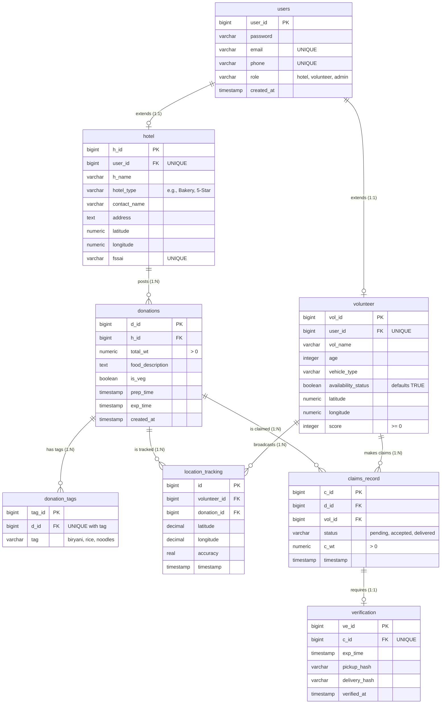

# FoodConnect Database ER Diagram

This document illustrates the final Entity-Relationship (ER) model for the FoodConnect PostgreSQL Database, visualizing how data connects to maintain system integrity. This reflects the most recent updates containing enriched tracking and profile columns.

## Entity Relationship Visualization

## Structural Design Notes

1.  **Identity Management**: The `users` table acts as the master identifier. The `hotel` and `volunteer` tables map exclusively to a single user (`UNIQUE ForeignKey`), allowing polymorphic-like behavior for authentication routing.
2.  **Referential Integrity Constraints (Cascades)**: Data deletion flows downward. E.g., if a `hotel` account is deleted, the cascade destroys their `donations`, which subsequently destroys any `donation_tags` or `claims_record` attached to that specific donation, ensuring no orphaned data remains.
3.  **Strict State Control**: Entities like `claims_record.status` and `donation_tags.tag` are heavily constrained using `CHECK` variables directly on the database level rather than just depending on API validation, providing an unalterable source of truth.
4.  **Transaction Security**: `verification` uses a 1:1 map to `claims_record` (`UNIQUE c_id`), serving as the physical OTP handshake locker required before a claim's status can shift to `delivered`.
5.  **Location Analytics**: The `location_tracking` table aggregates a breadcrumb trail tightly coupled to both the executing `volunteer` and the active `donation` payload, mapping out accurate operational history.
